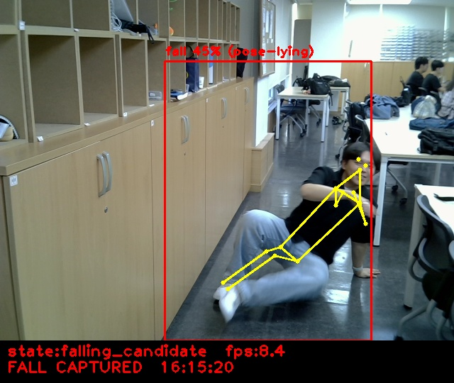
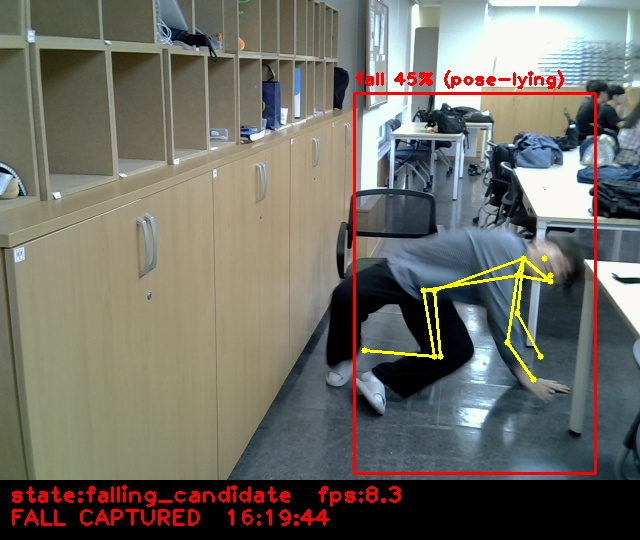
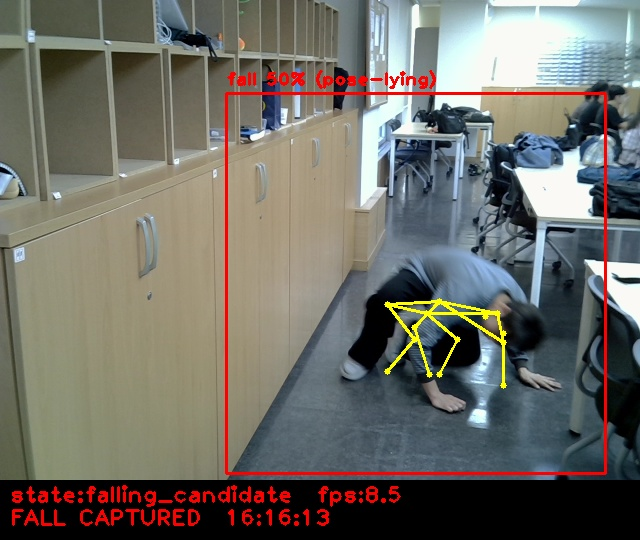

# Team8 — 낙상 사고 감지 시스템

**라즈베리파이 On-Device AI 낙상 감지 (YOLO11n + YOLO11n-pose, 시간 기반 판정)**

고정된 카메라 영상에서 사람을 찾아 한 명을 계속 추적하면서 매 프레임 자세(스켈레톤)를 추정합니다. "서 있다가 빠르게 내려가는 하강"과 "넘어진 자세가 이어지는 시간"을 함께 보고 낙상을 확정합니다. 넘어진 상태가 5초 이상 이어지면 긴급 경고를 띄우고, 낙상 전후 영상을 자동으로 저장합니다.

## 목차
1. [프로젝트 개요](#프로젝트-개요)
2. [문제 정의 및 해결 방향](#문제-정의-및-해결-방향)
3. [시스템 구조](#시스템-구조)
4. [낙상 판정 방식](#낙상-판정-방식)
5. [화면 표시](#화면-표시)
6. [하드웨어 구성](#하드웨어-구성)
7. [파일 구성](#파일-구성)
8. [실행 방법](#실행-방법)
9. [주요 설정값](#주요-설정값)
10. [데이터셋 및 학습](#데이터셋-및-학습)
11. [결과 예시](#결과-예시)
12. [한계점](#한계점)
13. [업데이트 내역](#업데이트-내역)

---

## 프로젝트 개요

| 항목 | 내용 |
|---|---|
| 프로젝트명 | Team8 낙상 사고 감지 시스템 |
| 사용 모델 | YOLO11n (사람 검출 + fall 점수, 전이학습) / YOLO11n-pose (자세 추정, 재학습 없이 사용) |
| 모델 형식 | tflite int8 양자화 |
| 판정 방식 | 포즈 기반 하강 감지 + 넘어진 자세 지속 시간 누적 (시간 기반 상태 기계) |
| 실행 환경 | Raspberry Pi + USB 웹캠 |
| 학습 환경 | Google Colab (Tesla T4) |
| 팀 구성 | 4인 |

낙상은 혼자 있는 고령자나 작업자에게 치명적인 사고로 이어질 수 있지만, 사람이 화면을 계속 지켜보며 감시하기는 어렵습니다. 이 프로젝트는 카메라 영상만으로 넘어지는 순간을 자동으로 판단하고, 쓰러진 채 일어나지 못하는 상황은 긴급 상황으로 구분해 알리는 것을 목표로 합니다.

## 문제 정의 및 해결 방향

| 문제 | 해결 방향 |
|---|---|
| 한 프레임만 보는 CNN 판정으로는 넘어지는 "과정"을 볼 수 없고, 누워 있는 모습만으로 오탐이 생김 | 최근 1.5초의 자세 기록과 비교해 **서 있다가 빠르게 내려가는 하강**을 감지 |
| TV·가구 같은 정지 사물이 사람으로 검출됨 | 대상 박스에서 포즈가 2초 넘게 안 잡히면 그 영역을 잠시 대상에서 제외 |
| 한 사람에게 fall/non-fall 박스가 겹쳐 나오면 NMS에서 fall 근거가 사라짐 | 클래스 구분 없이 NMS를 하고, 겹치는 fall 후보의 점수는 따로 보관 |
| 넘어지는 순간 박스가 세로→가로로 급변해 추적이 끊김 | IoU가 끊겨도 중심 거리가 가까우면 같은 사람으로 이어 붙임 |
| 바닥에 누우면 관절이 가려지고 int8 포즈가 프레임마다 흔들림 | 0.6초 이내의 끊김은 허용하고, 관측이 빠진 시간은 누적에서 제외 |
| 허리 숙이기나 앉기를 낙상으로 오인 | 골반·어깨가 함께 내려가고 몸통 각도도 바뀌어야 하강으로 인정 |
| 넘어진 뒤 일어나지 못하는 상황이 가장 위험함 | 낙상 확정 후 넘어진 상태가 5초 이어지면 **긴급(Emergency)** 경고 |
| 사후에 낙상 장면을 확인할 수 있어야 함 | 낙상 전 3초 + 후 5초 영상을 판정 화면과 순수 캠 영상 두 벌로 자동 저장 |

## 시스템 구조

<p align="center">
  
</p>

| 단계 | 하는 일 | 사용 기술 |
|---|---|---|
| ① 사람 검출 | 화면의 사람 박스를 찾고, 박스마다 fall 점수를 함께 보관 | YOLO11n (int8 tflite) |
| ② 대상 추적 | 가장 큰 사람을 대상으로 골라 프레임마다 같은 사람을 이어서 추적 | IoU + 중심 거리 매칭 |
| ③ 자세 추정 | 대상 박스에서 17개 관절을 찾아 누움 여부, 몸통 각도, 골반 높이를 계산 | YOLO11n-pose (int8 tflite) |
| ④ 시간 판정 | 하강 감지와 넘어진 자세의 지속 시간으로 낙상을 확정하고 회복을 판단 | 시간 기반 상태 기계 |
| 낙상 확정 | 판정 화면 사진 저장, 화면 3초 정지, 전후 영상 자동 녹화 | OpenCV |
| 긴급 경고 | 확정 후 넘어진 상태가 5초 이상 이어지면 긴급 배너 표시 및 추가 녹화 | OpenCV |

> ①의 fall 점수는 ②·③에서는 쓰이지 않고, ④에서 "넘어진 자세"를 인정하는 근거 중 하나로만 쓰입니다. 판정의 중심은 포즈와 시간 기록입니다.

## 낙상 판정 방식

<p align="center">
  
</p>

| 단계 | 조건 (기본값) |
|---|---|
| 하강 감지 | 1.5초 안의 과거 프레임이 서 있던 자세(몸통 35° 이하)였고, 그 뒤 골반이 박스 높이의 18% 이상(주저앉는 경우 골반 10% + 어깨 18%), 초당 20% 이상 속도로 내려가며, 몸통 각도가 20° 이상 커지거나 박스가 가로로 넓어짐 |
| 넘어진 자세 근거 | 누운 자세(또는 몸통 50° 이상 + 관절이 가로로 넓게 퍼짐)이면서, CNN이 fall로 보거나 최근 3초 안에 하강이 있었음 |
| 낙상 확정 | 근거가 이어진 시간이 **하강 후 0.4초** 또는 **하강 없이 1.5초** 이상 |
| 회복 | 확정 후 똑바로 선 자세가 1초 동안 끊김 없이 이어짐 |
| 긴급 | 확정 후 넘어진 상태로 관측된 시간이 5초 이상 (회복 확정까지 유지) |

모든 시간은 프레임 수가 아니라 초 단위로 계산하므로, 라즈베리파이의 FPS가 바뀌어도 기준 시간은 같습니다. 각 조건의 세부 식과 전체 설정값은 **[낙상 감지 알고리즘 정리 문서](docs/fall_detection_algorithm.md)** 에 정리되어 있습니다.

## 화면 표시

대상 박스, 화면 상단 글자, 하단 막대가 모두 현재 판정 상태의 색으로 표시됩니다.

| 상태 | 의미 | 색 |
|---|---|---|
| `unknown` | 사람이나 포즈가 안 보이거나 자세가 애매해 판단 보류 | ⬜ 회색 |
| `standing` | 똑바로 선 정상 자세 | 🟩 초록 |
| `falling_candidate` | 하강 또는 넘어진 자세가 보여 낙상 의심 | 🟧 주황 |
| `fallen` | 낙상 확정 (확정 순간 사진 저장·녹화) | 🟥 빨강 |
| `recovering` | 확정 후 일어선 자세가 보여 회복 확인 중 | 🟦 하늘색 |
| `emergency` | 넘어진 상태 5초 이상 지속 — 빨간 테두리 깜빡임 + `EMERGENCY - HELP REQUIRED` 배너 | 🟥 빨강 |

- 스켈레톤은 판정 색과 구분되도록 청록색으로 그립니다. 대상이 아닌 다른 검출 박스는 얇은 회색 선으로 표시됩니다.
- 낙상 확정 후 긴급 전까지는 화면에 `Emergency timer: x/5s`가 표시됩니다.
- CNN 클래스 순서 `CLASS_NAMES = {0: fall, 1: non-fall}`는 학습에 쓴 `data.yaml`의 `names` 순서와 같아야 합니다. 모델 파일에 클래스 정보가 들어 있으면 실행 시 자동으로 확인합니다.

## 하드웨어 구성

| 부품 | 역할 | 비고 |
|---|---|---|
| Raspberry Pi | 모델 추론, 판정, 화면 출력, 녹화 | tflite 런타임 + OpenCV + NumPy |
| USB 웹캠 | 영상 입력 | 해상도는 카메라 기본값 사용 |

## 파일 구성

| 구분 | 파일 | 설명 |
|---|---|---|
| 실행 | `test.py` | **메인 실행 파일 (ver7)** — 사람 검출 → 대상 추적 → 자세 추정 → 시간 판정 → 긴급 경고, 자동 녹화 |
| 모델 | `best_Hfall_int8.tflite` | YOLO11n 낙상 검출 모델 (int8, 320×320) |
| 모델 | `yolo11n-pose_int8.tflite` | YOLO11n-pose 포즈 추정 모델 (int8, COCO 사전학습) |
| 학습 | `train.ipynb` | Colab 학습 및 tflite export 노트북 |
| 문서 | `docs/fall_detection_algorithm.md` | 판정 알고리즘 상세와 전체 설정값 정리 |
| 문서 | `docs/*.png` | 시스템 구조, 판정 상태 흐름 그림 |
| 실험 | `test_emergency.py` | 긴급 판단 초기 실험 파일 (낙상 확정 상태가 10초 이상 지속되면 emergency) |
| 실험 | `test_pose_first.py` | 이전 비교 실험 — 포즈 우선 구조 (포즈로 누운 후보를 찾고 CNN은 거부권만 행사) |
| 실험 | `test_pose.py` | 이전 비교 실험 — 포즈 단독 구조 (낙상 CNN 없이 포즈만으로 판정) |
| 실험 | `rec.py` | 이전 비교 실험용 원본 영상 녹화기 |
| 실험 | `state_machine.py` | 이전 버전의 상태 기계 (현재 `test.py`에서는 사용하지 않음) |
| 결과 | `results/` | 이전 버전(09-22)에서 포착한 낙상 이미지 |

## 실행 방법

```bash
# 필요 패키지: tflite 런타임, opencv-python, numpy
# (tflite_runtime → ai_edge_litert → tensorflow 순서로 설치된 것을 찾아 사용)

# 웹캠으로 실행
python3 test.py --source 0

# 저장된 영상으로 다시 판정 (화면 없이, 전체 판정 영상 저장)
python3 test.py --source clips/clip_날짜_시각_raw.avi --headless --save-preview
```

| 옵션 | 기본값 | 설명 |
|---|---|---|
| `--source` | `0` | 카메라 번호 또는 영상 파일 경로 (영상 파일은 FPS 정보가 있어야 함) |
| `--model` | `best_Hfall_int8.tflite` | 낙상 검출 모델 경로 |
| `--pose-model` | `yolo11n-pose_int8.tflite` | 포즈 모델 경로 |
| `--output-dir` | `clips` | 결과 저장 폴더 |
| `--headless` | 꺼짐 | 화면 없이 실행 |
| `--save-preview` | 꺼짐 | 실행 전체의 판정 화면을 하나의 영상으로 저장 |
| `--max-frames` | `0` (무제한) | 처리할 최대 프레임 수 |
| `--no-raw` | 꺼짐 | 순수 캠 영상(`_raw`) 저장 끄기 |
| `--emergency-sec` | `5.0` | 긴급 판단 기준 시간(초) |

| 조작 | 동작 |
|---|---|
| `START REC` 버튼 / `r` / 스페이스 | 수동 녹화 시작·종료 (`clip_..._manual.avi`) |
| `QUIT` 버튼 / `q` | 종료 |

**저장되는 파일** (`clips/` 폴더)

| 파일 | 내용 |
|---|---|
| `clip_날짜_시각.avi` / `_raw.avi` | 낙상·긴급 이벤트 영상 (트리거 전 3초 ~ 마지막 트리거 후 5초). 판정 화면 / 순수 캠 영상 |
| `clip_날짜_시각.json` | 이벤트 메타데이터 (트리거 시각, 판정 이유 등) |
| `clip_날짜_시각.jpg` | 낙상 확정·긴급 발생 순간의 판정 화면 |
| `clip_..._manual.avi`, `clip_..._preview.avi` | 수동 녹화, 전체 판정 영상 (각각 `_raw` 동반) |
| `predictions.jsonl` | 프레임별 상태, 관측값, 근거 누적 시간, 긴급 타이머 |
| `summary.json` | 실행 요약 (알람·긴급 횟수, 진단 집계) |

> 녹화된 `_raw.avi`를 `--source`로 다시 넣으면, 설정값만 바꿔 같은 장면을 반복해서 재판정할 수 있습니다.

## 주요 설정값

`test.py` 상단의 상수로 조정합니다. 전체 목록과 올리거나 내렸을 때의 효과는 [알고리즘 정리 문서](docs/fall_detection_algorithm.md#3-설정값-총정리)에 있습니다.

| 설정 | 기본값 | 의미 |
|---|---|---|
| `CONF_TH` | 0.45 | 검출 신뢰도 임계값 (fall 근거 인정 기준으로도 사용) |
| `DROP_RATIO` | 0.18 | 하강으로 인정할 골반 하강량 (박스 높이 대비) |
| `DROP_SPEED` | 0.20 | 하강으로 인정할 초당 하강량 (박스 높이 대비) |
| `FAST_CONFIRM_SEC` | 0.4 | 하강을 본 뒤 확정까지 필요한 시간 |
| `LYING_CONFIRM_SEC` | 1.5 | 하강 없이 넘어진 자세만으로 확정할 시간 |
| `RECOVERY_SEC` | 1.0 | 회복으로 인정할 똑바로 선 자세의 지속 시간 |
| `EMERGENCY_SEC` | 5.0 | 확정 후 긴급으로 전환할 시간 (`--emergency-sec`로도 지정) |
| `PRE_EVENT_SEC` / `POST_EVENT_SEC` | 3.0 / 5.0 | 이벤트 영상에 포함할 전/후 시간 |

## 데이터셋 및 학습

| 항목 | 내용 |
|---|---|
| 데이터셋 | Roboflow `Human Fall Detection (relabel)` (YOLOv11 형식) |
| 클래스 | `fall`, `non-fall` |
| 베이스 모델 | `yolo11n.pt` (COCO 사전학습) 전이학습 |

**학습 설정**

| 항목 | 값 | 이유 |
|---|---|---|
| `imgsz` | 320 | 라즈베리파이 배포 해상도와 동일하게 |
| `epochs` / `patience` | 100 / 20 | 20에폭 동안 개선이 없으면 조기 종료 |
| `batch` | 32 | |
| `degrees`, `flipud` | 0.0 | 회전·상하반전 금지 — 서 있는 사람이 누운 사람처럼 보여 라벨 의미가 깨짐 |
| `fliplr` | 0.5 | 좌우반전은 라벨 의미에 영향 없음 |

**성능** (Colab, Tesla T4)

| 평가 세트 | 이미지 수 | Precision | Recall | mAP50 | mAP50-95 |
|---|---|---|---|---|---|
| Validation | 859 | 0.997 | 0.975 | 0.994 | 0.850 |
| Test | 2,152 | 0.907 | 0.940 | **0.929** | 0.619 |

**모델 변환**

```python
# 낙상 검출 모델
model.export(format="tflite", imgsz=320, int8=True, data="data.yaml")

# 포즈 모델 (COCO 사전학습 그대로 사용, 재학습 없음)
YOLO("yolo11n-pose.pt").export(format="tflite", imgsz=192, int8=True)
```

## 결과 예시

아래는 **이전 버전(09-22, 움직임 필터 방식)** 에서 라즈베리파이로 포착한 이미지입니다. 현재 버전의 화면은 상태별 색과 긴급 배너가 추가되어 모습이 다릅니다.

<table>
  <tr>
    <td align="center"><br>옆으로 쓰러지는 순간</td>
    <td align="center"><br>바닥에 엎드린 자세</td>
  </tr>
  <tr>
    <td align="center"><br>뒤로 넘어진 자세</td>
    <td align="center"><br>앞으로 고꾸라지는 순간</td>
  </tr>
</table>

## 한계점

- **한 번에 한 명만 추적합니다.** 가장 큰 박스를 대상으로 잡기 때문에, 여러 명이 있으면 카메라에 가까운 사람만 판정합니다.
- **포즈 누락에 민감한 부분이 있습니다.** 낙상 확정 후 포즈가 0.75초 넘게 안 잡히면 긴급 타이머가 0으로 돌아가고, 화면 상태도 잠시 `unknown`으로 바뀝니다.
- 이전 버전 결과에서 실제 촬영 환경의 CNN fall 신뢰도가 45~50%로 임계값(0.45) 근처였습니다. 공개 데이터셋과 실제 환경 사이에 차이가 있어, 현재 버전은 CNN을 보조 근거로만 사용합니다.
- 경고는 화면 표시와 파일 저장으로만 이루어지며, 외부로 전달되는 알림은 없습니다.

## 업데이트 내역

> 메인 코드(`test.py` 또는 관련 모듈)가 바뀔 때마다 아래에 새 항목을 위로 추가합니다.
> 형식: `### YYYY-MM-DD 오전/오후 H:MM — 한 줄 요약` → **변경된 파일** → 무엇을 왜 바꿨는지 → (선택) 결과 사진

### 2026-09-23 오후 3:59 — 긴급(Emergency) 단계 추가 (ver7)
**변경된 파일**: `test.py`

- 낙상 확정 후 넘어진 상태로 관측된 시간이 `EMERGENCY_SEC`(5초) 이상이면 `emergency` 상태로 전환
- 관측이 빠진 시간은 합산하지 않으며, 긴급 상태는 회복이 확정될 때까지 유지
- 빨간 테두리 깜빡임 + `EMERGENCY - HELP REQUIRED` 배너 표시, 확정 후에는 `Emergency timer` 표시
- 긴급 발생 순간에도 사진 저장과 이벤트 녹화를 트리거
- `--emergency-sec` 옵션 추가, `summary.json`에 긴급 횟수 기록

### 2026-09-23 오후 3:08 — 긴급 판단 테스트 파일 추가
**추가된 파일**: `test_emergency.py`

- 낙상 확정 상태가 10초 이상 지속되면 `emergency`로 전환하는 초기 실험 버전

### 2026-09-23 오후 2:54 — 시간 기반 판정 구조로 전면 개편 (ver6)
**변경된 파일**: `test.py`

- 프레임 차분 기반 움직임 필터를 제거하고, 포즈가 2초 넘게 안 잡히는 박스를 대상에서 제외하는 방식으로 정지 사물을 처리
- 클래스 구분 없는 NMS로 사람을 검출하고, 겹치는 fall 후보의 점수를 따로 보관
- 가장 큰 사람을 대상으로 골라 IoU·중심 거리로 추적, 대상에 대해 매 프레임 포즈 추정
- 하강 감지 + 넘어진 자세 지속 시간으로 낙상을 확정하는 시간 기반 상태 기계 도입, 1초간 똑바로 서면 회복
- 낙상 전 3초 + 후 5초 이벤트 영상 자동 저장 (판정 화면 + 순수 캠 영상)
- `predictions.jsonl`, `summary.json` 로그와 실행 옵션(`--source`, `--headless` 등) 추가

### 2026-09-23 오전 10:33 — 순수 캠 영상도 함께 저장
**변경된 파일**: `test.py`

- 녹화 기본값을 `both`로 바꿔, 판정 화면(`clip_....avi`)과 표시 없는 순수 캠 영상(`clip_..._raw.avi`)을 함께 저장

### 2026-09-23 오전 10:05 — `test.py` 녹화 기능 추가
**변경된 파일**: `test.py`

- 화면 하단에 `START REC` / `STOP & SAVE` / `QUIT` 버튼 추가 (키보드 `r`·스페이스·`q`도 지원)
- 처리 속도가 느린 구간은 프레임을 복제하고 프리즈 구간은 생략하여, 재생 길이가 실제 촬영 시간과 같도록 보정

### 2026-09-23 오전 10:04 — 구조 비교 실험 파일 추가
**추가된 파일**: `test_pose_first.py`, `test_pose.py`, `rec.py`

- 당시 CNN 우선 구조와 비교하기 위해 포즈 우선, 포즈 단독 구조를 별도 파일로 구현
- 세 구조에 같은 영상을 넣기 위한 원본 녹화기(`rec.py`) 추가

### 2026-09-22 오후 4:42 — 최초 실행 성공 (움직임 필터 + 포즈 확인)
**추가된 파일**: `test.py`, `state_machine.py`, `best_Hfall_int8.tflite`, `yolo11n-pose_int8.tflite`

- 라즈베리파이에서 낙상 CNN을 실시간 추론하고, 박스 내부 움직임으로 정지 사물 오탐을 제거
- fall 박스에 한해 YOLO11n-pose로 누운 자세를 확인하고, CNN과 포즈가 동시에 동의한 순간을 캡처

결과:
<br>

