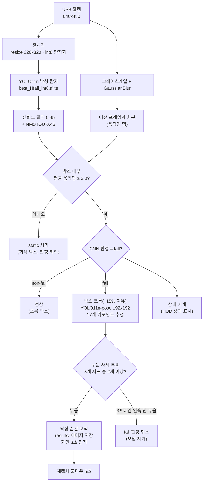
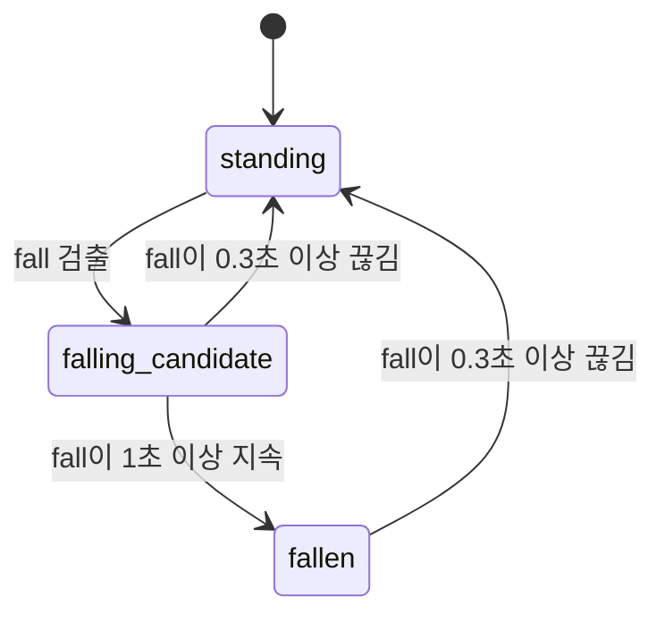

# Team8 — 낙상 사고 감지 시스템

**라즈베리파이 On-Device AI 낙상 감지 (YOLO11n + YOLO11n-pose, 움직임 게이팅)**

라즈베리파이 위에서 int8로 경량화한 YOLO11n 낙상 탐지 모델을 실시간으로 구동하고, 낙상으로 의심되는 사람에 한해 포즈(스켈레톤) 추정으로 "정말 누운 자세인지"를 한 번 더 확인하여, 낙상 순간을 자동으로 포착·저장하는 시스템입니다.

## 목차
1. [프로젝트 개요](#프로젝트-개요)
2. [문제 정의 및 개발 배경](#문제-정의-및-개발-배경)
3. [탐지 클래스](#탐지-클래스)
4. [시스템 구조](#시스템-구조)
5. [판정 로직 상세](#판정-로직-상세)
6. [하드웨어 구성](#하드웨어-구성)
7. [파일 구성](#파일-구성)
8. [실행 방법](#실행-방법)
9. [데이터셋 및 학습](#데이터셋-및-학습)
10. [결과 예시](#결과-예시)
11. [업데이트 내역](#업데이트-내역)

---

## 프로젝트 개요

| 항목 | 내용 |
|---|---|
| 프로젝트명 | Team8 낙상 사고 감지 시스템 |
| 사용 모델 | YOLO11n (낙상 탐지, 전이학습) + YOLO11n-pose (자세 확인, COCO 사전학습 그대로 사용) |
| 모델 형식 | tflite int8 양자화 (`tflite_runtime`으로 추론, ultralytics 설치 불필요) |
| 실행 환경 | Raspberry Pi + USB 웹캠 |
| 학습 환경 | Google Colab (Tesla T4) |
| 팀 구성 | 4인 |

낙상은 혼자 있는 고령자나 작업자에게 치명적인 사고로 이어질 수 있지만, 사람이 화면을 계속 지켜보며 감시하기는 어렵습니다. 이 프로젝트는 고정된 카메라 영상만으로 "서 있던 사람이 넘어지는 순간"을 자동으로 감지하고, 해당 장면을 이미지로 남겨 사후 확인이 가능하도록 하는 것을 목표로 합니다.

## 문제 정의 및 개발 배경

- **단일 CNN의 오탐 문제**: 낙상 탐지 모델만 사용하면 TV 화면, 소파에 누운 사람, 배경 사물 등을 `fall`로 오인하는 경우가 많았음
- **움직임 게이팅**: 낙상은 "움직임을 동반하는 사건"이므로, 탐지 박스 내부에 움직임이 없으면 정지된 사물로 보고 판정에서 제외
- **포즈 기반 2차 확인**: CNN이 `fall`로 본 박스에 한해서만 포즈 모델을 추가로 돌려, 몸통·다리 각도와 키포인트 분포로 누운 자세인지 교차 검증 (연산량 절약)
- **순간 포착**: 넘어진 뒤 가만히 누워 있으면 움직임 게이팅에 걸려 "지속 시간" 기반 확정까지 가지 못하므로, CNN과 포즈가 **동시에 동의한 프레임**을 즉시 캡처하는 방식으로 설계

## 탐지 클래스

| ID | 클래스명 | 의미 | 화면 표시 |
|---|---|---|---|
| 0 | `fall` | 넘어진/쓰러진 자세 | 🟥 빨강 박스 |
| 1 | `non-fall` | 정상 자세 (서 있음, 앉음 등) | 🟩 초록 박스 |
| – | `static` | 움직임이 없어 판정에서 제외된 박스 | ⬜ 회색 박스 |

- `CLASS_NAMES`의 순서는 학습 시 사용한 `data.yaml`의 `names` 순서와 반드시 일치해야 합니다. 순서가 다르면 `fall`과 `non-fall`이 뒤바뀐 채로 동작합니다.
- 포즈 판정 결과는 박스 라벨 뒤에 `(pose-lying)` / `(pose-stand)`로 함께 표시됩니다.

## 시스템 구조

### 전체 파이프라인 (`test.py`)



> 낙상 CNN이 전체 프레임을 먼저 보고, **움직임이 있는 `fall` 박스에 대해서만** 포즈 모델을 추가로 실행합니다. CNN과 포즈가 같은 프레임에서 동시에 "낙상 + 누운 자세"에 동의하면 그 순간을 캡처합니다.

### 상태 기계 (`state_machine.py`)



> 프레임 수가 아닌 **초 단위**로 판정하므로 라즈베리파이의 실제 FPS와 무관하게 동일하게 동작합니다. 0.3초 이내의 짧은 미검출은 노이즈로 간주합니다. 현재 캡처/프리즈는 상태 기계와 별개로 프레임 단위 트리거로 동작하며, 상태 기계는 화면 하단 HUD 표시용입니다.

## 판정 로직 상세

### 1. 움직임 게이팅
연속된 두 프레임의 그레이스케일 차분(`absdiff`)을 구한 뒤, 각 탐지 박스 영역 안의 평균 변화량이 `MOTION_TH = 3.0`보다 작으면 가만히 있는 사물(TV, 사진, 배경 등)로 보고 판정에서 제외합니다.

### 2. 포즈 기반 누운 자세 판단 (3지표 투표)

| 지표 | 계산 방법 | 기준 |
|---|---|---|
| 몸통 각도 | 어깨 중심 → 엉덩이 중심 축이 수직선과 이루는 각도 | 55° 초과 시 1표 |
| 다리 각도 | 엉덩이 중심 → 발목 중심 축이 수직선과 이루는 각도 | 60° 초과 시 1표 |
| 가로세로비 | 신뢰도 0.4 이상인 키포인트 전체를 감싸는 박스의 가로/세로 | 1.0 초과 시 1표 |

- 3개 중 **2표 이상**이면 "누운 자세"로 판단합니다.
- 계산 가능한 지표가 2개 미만이면(가려짐 등) 판단을 보류하고 CNN 판정만 사용합니다.
- int8 포즈 모델이 프레임마다 흔들리는 노이즈를 고려해, 포즈가 **3프레임 연속** "안 누움"일 때만 CNN의 `fall` 판정을 취소합니다.

### 3. 캡처 및 프리즈
- 트리거 조건: 한 프레임 안에서 CNN = `fall` **그리고** 포즈 = 누움
- 박스·스켈레톤·`FALL CAPTURED` 문구가 그려진 화면을 `results/fall_날짜_시각_밀리초.jpg`로 저장
- 같은 화면으로 3초간 정지한 뒤, 5초 쿨다운 동안 같은 낙상의 중복 캡처를 막습니다.

## 하드웨어 구성

| 부품 | 역할 | 비고 |
|---|---|---|
| Raspberry Pi | 모델 추론 및 화면 출력 | `tflite_runtime` + OpenCV + NumPy |
| USB 웹캠 | 영상 입력 | 640x480 캡처, 버퍼 크기 1 |

## 파일 구성

| 파일 | 설명 |
|---|---|
| `test.py` | **메인 실행 파일** — CNN 우선 구조 (낙상 CNN → fall 박스만 포즈로 재확인) + 녹화 기능 |
| `state_machine.py` | 초 단위 낙상 상태 기계 (`standing` → `falling_candidate` → `fallen`) |
| `best_Hfall_int8.tflite` | YOLO11n 낙상 탐지 모델 (int8, 320x320) |
| `yolo11n-pose_int8.tflite` | YOLO11n-pose 포즈 추정 모델 (int8, COCO 사전학습) |
| `train.ipynb` | Colab 학습 및 tflite export 노트북 |
| `test_pose_first.py` | [비교 실험] 포즈 우선 구조 — 포즈로 누운 후보를 찾고 CNN은 거부권(veto)만 행사 |
| `test_pose.py` | [비교 실험] 포즈 단독 구조 — 낙상 CNN 없이 포즈 모델만으로 판정 |
| `rec.py` | [비교 실험] 웹캠 녹화기 — 세 구조를 같은 영상으로 비교하기 위한 원본 클립 녹화 |
| `results/` | 낙상 순간 캡처 이미지 저장 폴더 |

### 비교 실험 구조

| 구조 | 파일 | 판단 순서 | 특징 |
|---|---|---|---|
| CNN 우선 | `test.py` | 낙상 CNN → 포즈 재확인 | 포즈 연산을 fall 후보에만 사용해 가벼움 |
| 포즈 우선 | `test_pose_first.py` | 포즈 → 누운 후보에만 CNN | CNN이 놓친 낙상을 포즈가 잡을 수 있음 |
| 포즈 단독 | `test_pose.py` | 포즈만 사용 | 포즈 우선 구조와 비교해 CNN의 기여도를 확인 |

> 세 구조가 완전히 같은 프레임을 보고 판단하도록, `rec.py`로 녹화한 클립을 `cv2.VideoCapture("clips/clip_....avi")`로 넣어 비교합니다.

## 실행 방법

```bash
# 필요 패키지 (라즈베리파이)
pip install tflite-runtime opencv-python numpy

# 실행
python3 test.py
```

| 조작 | 동작 |
|---|---|
| `START REC` 버튼 / `r` / 스페이스 | 녹화 시작 |
| `STOP & SAVE` 버튼 / `r` / 스페이스 | 녹화 종료 및 자동 저장 (`clips/clip_날짜_시각.avi`) |
| `QUIT` 버튼 / `q` | 종료 (녹화 중이면 저장 후 종료) |

- `RECORD_MODE`로 녹화 내용을 선택할 수 있습니다: `overlay`(박스·스켈레톤 포함, 기본) / `clean`(표시 없는 원본) / `both`(두 파일 동시 저장)
- 처리 속도가 변해도 재생 길이가 실제 촬영 시간과 같도록 프레임을 복제·생략해 저장합니다.
- 진단 로그가 필요하면 `DEBUG = True`로 바꾸면 프레임마다 검출/움직임/포즈 정보가 출력됩니다.

## 데이터셋 및 학습

1. **데이터셋**: Roboflow `Human Fall Detection (relabel)` (YOLOv11 형식), 클래스 `fall` / `non-fall`
2. **모델**: `yolo11n.pt` (COCO 사전학습) 기반 전이학습
3. **학습 설정**

| 항목 | 값 | 이유 |
|---|---|---|
| imgsz | 320 | 라즈베리파이 배포 해상도와 동일하게 |
| epochs / patience | 100 / 20 | 20에폭 개선 없으면 조기 종료 |
| batch | 32 | |
| degrees, flipud | 0.0 | 회전·상하반전 금지 — 서 있는 사람이 누운 사람처럼 보여 라벨 의미가 깨짐 |
| fliplr | 0.5 | 좌우반전은 라벨 의미에 영향 없음 |

4. **성능** (Colab, Tesla T4)

| 평가 세트 | 이미지 수 | Precision | Recall | mAP50 | mAP50-95 |
|---|---|---|---|---|---|
| Validation | 859 | 0.997 | 0.975 | 0.994 | 0.850 |
| Test | 2,152 | 0.907 | 0.940 | **0.929** | 0.619 |

5. **Export**: `model.export(format='tflite', imgsz=320, int8=True)`로 int8 양자화
6. **포즈 모델**: `YOLO("yolo11n-pose.pt").export(format="tflite", int8=True, imgsz=192)` — 사람 자세는 범용적으로 잘 잡으므로 재학습 없이 사용

## 결과 예시

| 결과 예시 1 | 결과 예시 2 |
|---|---|
|  |  |

> 낙상이 포착되면 박스(빨강)·스켈레톤(노랑)·`FALL CAPTURED` 문구가 그려진 화면이 `results/`에 자동 저장됩니다.

## 업데이트 내역

> 메인 코드(`test.py` 또는 관련 모듈)가 바뀔 때마다 아래에 새 항목을 위로 추가합니다.
> 형식: `### YYYY-MM-DD 오전/오후 H:MM — 한 줄 요약` → **변경된 파일** → 무엇을 왜 바꿨는지 → (선택) 결과 사진

### 2026-09-23 오전 10:05 — `test.py` 녹화 기능 추가
**변경된 파일**: `test.py`

- 화면 하단에 `START REC` / `STOP & SAVE` / `QUIT` 버튼 추가 (키보드 `r`·스페이스·`q`도 지원)
- `RECORD_MODE`(`overlay`/`clean`/`both`)로 저장 내용 선택 가능
- 처리 속도가 느린 구간은 프레임 복제, 프리즈 구간은 생략하여 **재생 길이 = 실제 촬영 시간**이 되도록 보정
- 프리즈(화면 정지) 중에도 녹화가 이어지도록 하여, 넘어진 직후 구간이 클립에서 빠지지 않게 함

### 2026-09-23 오전 10:04 — 구조 비교 실험 파일 추가
**추가된 파일**: `test_pose_first.py`, `test_pose.py`, `rec.py`

- CNN 우선(`test.py`) 구조와 비교하기 위해 **포즈 우선**, **포즈 단독** 구조를 별도 파일로 구현
- 누움 판단 3지표·임계값·움직임 게이팅·캡처 동작은 `test.py`와 동일하게 맞춰 **구조 차이만** 비교되도록 설계
- 세 구조에 같은 영상을 넣기 위한 원본 녹화기(`rec.py`) 추가

### 2026-09-22 오후 4:42 — 최초 실행 성공 (움직임 게이팅 + 포즈 확인)
**추가된 파일**: `test.py`, `state_machine.py`, `best_Hfall_int8.tflite`, `yolo11n-pose_int8.tflite`

- 라즈베리파이에서 `tflite_runtime`으로 낙상 CNN을 실시간 추론하고 fall/non-fall 박스 표시
- 박스 내부 움직임 기반 게이팅으로 정지 사물 오탐 제거
- fall 박스에 한해 YOLO11n-pose로 스켈레톤을 추정하고 3지표 투표로 누운 자세 확인
- CNN + 포즈가 동시에 동의한 순간을 캡처해 `results/`에 저장하고 3초간 화면 정지

결과:
<br>

