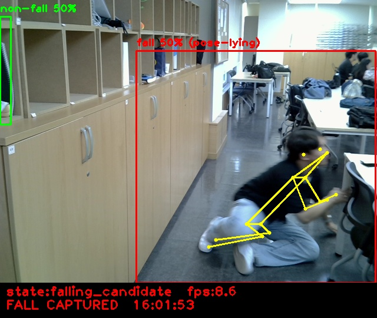
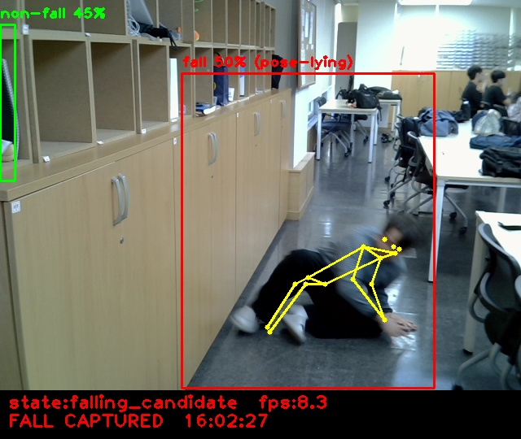

# Team8
TEAM8 : 낙상 사고 감지 시스템

## 실행 방법
python3 test.py 실행

## 파일
- test.py : 메인 파이썬 실행 파일
- best_Hfall_int8.tflite : YOLO 모델 가중치
- yolo11n-pose_int8.tflite : 포즈 판단 모델 가중치
- state_machine.py : 상태 머신 정의 class

## 결과 예시
- 결과 예시 1  

- 결과 예시 2  

