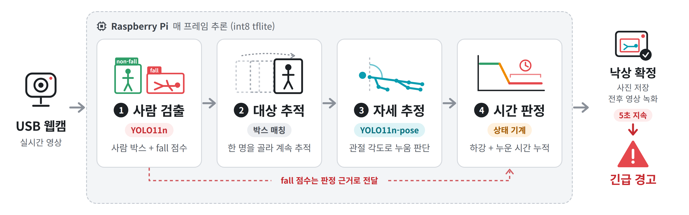
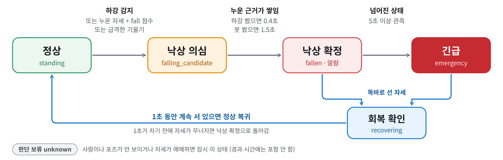

# 낙상 감지 알고리즘 정리 (`test.py`, ver7)

이 문서는 메인 실행 파일 `test.py`(ver7)가 한 프레임을 어떤 순서로 처리하는지, 낙상을 어떤 조건으로 확정하는지, 그리고 그 조건을 바꿀 수 있는 설정값이 무엇인지 정리한 것입니다.

한 줄 요약: **사람을 찾고 → 한 명을 골라 계속 따라가며 → 매 프레임 자세를 보고 → "서 있다가 빠르게 내려감(하강)"과 "누운 자세가 이어지는 시간"을 누적해 낙상을 확정하고, 넘어진 상태가 5초 이어지면 긴급 경고를 띄웁니다.**

---

## 1. 추론 순서

<p align="center">
  
</p>

| 단계 | 하는 일 | 다음 단계로 넘기는 것 |
|---|---|---|
| ① 사람 검출 | YOLO11n으로 화면의 사람 박스를 찾음. fall/non-fall 구분 없이 모두 "사람"으로 취급 | 사람 박스 목록, 박스별 fall 점수 |
| ② 대상 추적 | 그중 한 명을 대상으로 골라 프레임마다 같은 사람을 이어서 따라감 | 대상 박스 1개 |
| ③ 자세 추정 | 대상 박스를 잘라 YOLO11n-pose로 17개 관절을 찾고, 누움 여부·몸통 각도·골반 높이를 계산 | 관측값(`obs`) |
| ④ 시간 판정 | 최근 1.5초 기록과 비교해 하강을 찾고, 누운 근거가 쌓인 시간으로 낙상을 확정 | 상태, 알람 여부 |
| ⑤ 출력 | 확정 시 사진 저장·전후 영상 녹화, 5초 지속 시 긴급 경고 | – |

예전 버전(09-22, 움직임 필터 방식)과 달라진 점은 다음과 같습니다.

- 프레임 차분 기반 움직임 필터가 없어졌습니다. 정지 사물은 "포즈가 계속 안 잡히는 박스를 대상에서 제외"하는 방식으로 걸러냅니다.
- 포즈 추정을 fall 후보에만 하지 않고, 대상에 대해 **매 프레임** 실행합니다.
- 판정의 주체가 CNN에서 **포즈 + 시간 기록**으로 바뀌었습니다. CNN의 fall 점수는 ④에서 쓰는 근거 중 하나입니다.

---

## 2. 단계별 동작

### ① 사람 검출 (`detect_people`)

1. 프레임 전체를 YOLO11n(int8 tflite)에 넣고, 점수가 `CONF_TH`를 넘는 박스만 남깁니다.
2. fall과 non-fall 모두 사람이므로 **클래스 구분 없이** NMS(`IOU_TH`)로 겹치는 박스를 하나로 합칩니다.
3. NMS에서 non-fall 박스가 살아남더라도 fall 근거가 사라지지 않도록, 살아남은 박스와 `CLASS_MERGE_IOU` 이상 겹치는 fall 후보 중 최고 점수를 `fall_score`로 따로 보관합니다.

→ 살아남은 박스가 fall 클래스이거나 `fall_score > CONF_TH`이면, 이 사람의 CNN 판정을 fall로 봅니다.

### ② 대상 선택·추적

| 상황 | 동작 |
|---|---|
| 이미 대상이 있음 | 직전 대상 박스와 IoU가 `TARGET_IOU` 이상인 박스 중 가장 많이 겹치는 것을 선택 |
| IoU로 못 찾음 (넘어지며 박스가 세로→가로로 급변) | 중심 거리가 직전 박스 높이 × `REACQUIRE_DIST_RATIO` 이내인 가장 가까운 박스를 같은 사람으로 이어 붙임 |
| `MAX_GAP_SEC` 넘게 못 찾음 | 대상 해제 (상태 기계는 초기화하지 않음) |
| 대상이 없음 | 제외 영역에 걸리지 않은 박스 중 **가장 큰 박스**를 새 대상으로 선택 |
| 대상 박스에서 포즈가 `TARGET_STUCK_SEC` 넘게 안 잡힘 | TV·가구 같은 오검출로 보고 그 영역을 `TARGET_BLOCK_SEC` 동안 대상 후보에서 제외 |
| 이번 프레임에 검출이 없음 | 최근 `POSE_FALLBACK_SEC` 이내에 포즈가 잡혔다면, 직전 관절 영역을 넓혀 포즈만 다시 시도 (이때 CNN fall 근거는 없음으로 처리) |

### ③ 자세 추정과 관측값

대상 박스를 `POSE_PAD_RATIO`만큼 여유 있게 잘라 포즈 모델에 넣습니다. 사람 신뢰도가 `POSE_CONF_TH` 미만이면 실패로 처리하고, 최근 관절 영역으로 한 번 더 시도합니다.

**누운 자세 판단 (`is_lying_down`, 3지표 투표)**

| 지표 | 계산 | 1표 기준 |
|---|---|---|
| 몸통 각도 | 어깨 중심 → 골반 중심 축이 수직선과 이루는 각도 | `LYING_ANGLE_TH_DEG`(55°) 초과 |
| 다리 각도 | 골반 중심 → 발목 중심 축이 수직선과 이루는 각도 | `LEG_ANGLE_TH_DEG`(60°) 초과 |
| 관절 가로세로비 | 신뢰도 `KPT_CONF_TH` 이상인 관절(5개 이상)을 감싸는 박스의 가로/세로 | `KPT_ASPECT_TH`(1.0) 초과 |

계산 가능한 지표가 2개 이상일 때 `LYING_VOTE_MIN`(2)표 이상이면 누움, 아니면 안 누움입니다. 계산 가능한 지표가 2개 미만이면 판단을 보류(`None`)합니다.

**④로 넘기는 관측값 `obs`**

| 필드 | 의미 |
|---|---|
| `cy` | 골반 중심의 y좌표 (골반이 안 보이면 박스 중심) — 하강 계산에 사용 |
| `height` | 대상 박스 높이 — 하강량을 사람 크기로 나눠 비율로 만들 때 사용 |
| `aspect` | 대상 박스의 가로/세로 |
| `shoulder_y` | 어깨 중심의 y좌표 |
| `angle` | 몸통 각도 (어깨·골반 중 하나라도 안 보이면 `None`) |
| `pose_aspect` | 관절 가로세로비 |
| `lying` | 누움 판단 결과 (`True` / `False`) |
| `fall` | CNN fall 근거 |

포즈 추정이 실패했거나 `lying`이 `None`이면 `obs = None`(관측 누락)으로 넘깁니다.

### ④ 시간 판정 (`TemporalFallDetector`)

<p align="center">
  
</p>

시간은 모두 **초 단위**입니다. 카메라는 실제 경과 시간, 영상 파일은 `프레임 번호 / 영상 FPS`를 씁니다. 그래서 라즈베리파이 FPS가 바뀌어도 기준 시간은 같습니다.

**(1) 서 있음 판단**

`lying == False` 이고 몸통 각도가 `RECOVERY_ANGLE_DEG`(35°) 이하이면 "똑바로 선 자세(upright)"입니다. 하강의 출발점 조건과 회복 조건에 모두 쓰입니다.

**(2) 하강 감지** — 빠른 확정을 위한 핵심 조건

현재 관측을 최근 `HISTORY_SEC`(1.5초) 안의 과거 관측 하나하나와 비교해, 아래를 **모두** 만족하는 과거 시점이 하나라도 있으면 하강입니다.

| 조건 | 식 | 기본값 |
|---|---|---|
| 시간 간격 | `dt ≥ 0.08초` | 코드 고정 |
| 하강량 | `(현재 골반 y − 과거 골반 y) / 과거 박스 높이 ≥ DROP_RATIO` **또는** 앉듯이 주저앉음(아래) | 0.18 |
| 하강 속도 | `하강량 / dt ≥ DROP_SPEED` | 0.20 /초 |
| 자세 변화 | 몸통 각도가 `ANGLE_CHANGE` 이상 커짐 **또는** 박스 가로세로비가 0.35 이상 커짐 | 20° / 0.35(고정) |
| 출발 자세 | 과거 시점이 upright (안 누움 + 몸통 35° 이하) | – |

주저앉음(`seated_drop`)은 골반이 `SEATED_HIP_DROP_RATIO`(0.10) 이상, 어깨가 `SEATED_SHOULDER_DROP_RATIO`(0.18) 이상 함께 내려가고 몸통 각도도 20° 이상 커진 경우입니다. 어깨만 내려가는 허리 숙이기와 구별하기 위한 조건입니다.

하강이 감지되면 "낙상 의심" 상태가 되고, 그 뒤 `CANDIDATE_HOLD_SEC`(3초) 동안 "최근 하강 있음"으로 기억합니다.

**(3) 급격한 기울기**

과거 몸통 각도가 35° 이하였는데 20° 이상 커져 `DOWN_ANGLE_DEG`(50°) 이상이 되고 CNN도 fall이면, 의심만 시작합니다. 확정에는 쓰이지 않습니다.

**(4) 누운 근거(support)와 시간 누적**

```
넘어진 자세 = lying == True
             또는 (몸통 각도 ≥ DOWN_ANGLE_DEG 그리고 관절 가로세로비 ≥ DOWN_ASPECT_RATIO)

support     = 넘어진 자세
             그리고 (CNN fall 또는 최근 3초 안에 하강)
             그리고 upright 아님
```

- support인 프레임이 이어지는 동안 프레임 사이 시간을 `evidence_sec`에 더합니다. 두 프레임 간격이 `MAX_GAP_SEC`보다 길면 그 간격은 더하지 않습니다.
- support가 끊긴 시간이 `LYING_GRACE_SEC`(0.6초) 이내면 누적을 유지합니다. int8 포즈가 흔들리거나 바닥에서 관절이 가려지는 것을 봐주기 위해서입니다. 끊긴 시간은 누적에 포함하지 않습니다.
- upright가 나오거나 0.6초 넘게 끊기면 누적을 0으로 초기화합니다.

**(5) 낙상 확정**

| 경로 | 조건 | 8 FPS 기준 |
|---|---|---|
| 하강 + 넘어진 자세 | 최근 하강이 있고 `evidence_sec ≥ FAST_CONFIRM_SEC`(0.4초) | support 약 5프레임 연속 |
| 누운 상태 지속 | 하강을 못 봤고 `evidence_sec ≥ LYING_CONFIRM_SEC`(1.5초) | support 약 13프레임 연속 |

확정되는 프레임에서 알람이 **한 번** 발생하고 상태가 "낙상 확정(fallen)"이 됩니다.

**(6) 회복**

확정 후 upright가 `RECOVERY_SEC`(1초) 동안 끊김 없이 이어지면 "정상"으로 돌아가고 모든 기록을 초기화합니다. 그 사이 한 프레임이라도 upright가 아니거나 관측이 누락되면 회복 타이머가 다시 시작됩니다.

**(7) 관측 누락(`obs = None`)**

누락된 시간은 누운 시간·긴급 시간 어디에도 더하지 않습니다. 확정 상태에서 누락이 `MAX_GAP_SEC`(0.75초) 이내면 "낙상 확정" 표시를 유지하고, 그보다 길면 "판단 보류(unknown)"로 표시합니다(내부적으로 확정 여부는 유지).

### ⑤ 긴급(Emergency)

- 낙상 확정 후 "넘어진 상태로 관측된 시간"(`fallen_duration`)을 따로 셉니다.
- 이 값이 `EMERGENCY_SEC`(5초) 이상이 되면 긴급 상태가 됩니다. 이 순간 사진 저장과 이벤트 녹화가 한 번 더 트리거됩니다.
- 긴급 상태는 **회복이 확정될 때까지** 유지됩니다. 회복 확인 중에도 화면에는 `EMERGENCY`로 표시됩니다.
- 화면: 확정 후 긴급 전까지는 `Emergency timer: x/5s`, 긴급이 되면 빨간 테두리가 깜빡이고 `EMERGENCY - HELP REQUIRED` 배너가 뜹니다.

### ⑥ 출력

| 시점 | 동작 |
|---|---|
| 낙상 확정 / 긴급 발생 | `clips/clip_날짜_시각.jpg`로 판정 화면 저장 |
| 낙상 확정 | 화면을 `FREEZE_DURATION_SEC`(3초) 정지 (추론·녹화는 계속, 긴급 중에는 정지 안 함) |
| 낙상 확정 / 긴급 발생 | 이벤트 영상 저장: 트리거 전 `PRE_EVENT_SEC`(3초) ~ 마지막 트리거 후 `POST_EVENT_SEC`(5초). 판정 화면(`.avi`) + 순수 캠 영상(`_raw.avi`) + 메타데이터(`.json`) |
| 매 프레임 | `clips/predictions.jsonl`에 상태·관측값·근거 누적 시간·긴급 타이머 기록 |
| 종료 시 | `clips/summary.json`에 알람·긴급 횟수와 진단 집계 기록 |

---

## 3. 설정값 총정리

"올리면 / 내리면"은 코드 동작상 예상되는 방향입니다. 실제 값은 녹화 영상(`--source clip_..._raw.avi --headless`)으로 다시 돌려 `predictions.jsonl`을 보며 맞추는 것을 권장합니다.

### ① 사람 검출

| 설정 | 기본값 | 의미 | 올리면 / 내리면 |
|---|---|---|---|
| `CONF_TH` | 0.45 | 검출 신뢰도 임계값. fall 근거 인정 기준으로도 사용 | ↑ 검출·fall 근거가 줄어 놓칠 수 있음 / ↓ 오검출·fall 근거 증가 |
| `IOU_TH` | 0.45 | 클래스 무관 NMS 중복 제거 기준 | ↓ 겹친 박스를 더 적극적으로 합침 |
| `CLASS_MERGE_IOU` | 0.4 | 살아남은 박스에 fall 점수를 붙일 때의 겹침 기준 | ↓ fall 근거가 더 쉽게 붙음 |
| `CLASS_NAMES` | `{0: fall, 1: non-fall}` | 클래스 순서. `data.yaml`의 `names`와 같아야 함 | – |

### ② 대상 추적

| 설정 | 기본값 | 의미 | 올리면 / 내리면 |
|---|---|---|---|
| `TARGET_IOU` | 0.05 | 같은 사람으로 이어 붙일 최소 IoU | ↑ 넘어질 때 추적이 끊기기 쉬움 |
| `REACQUIRE_DIST_RATIO` | 1.2 | IoU가 끊겨도 같은 사람으로 볼 중심 거리 (직전 박스 높이 배수) | ↑ 멀리 떨어진 다른 사람으로 옮겨갈 위험 |
| `MAX_GAP_SEC` | 0.75 | 대상 유지·근거 누적·확정 표시·긴급 타이머에서 허용하는 최대 공백 | ↑ 누락에 관대해짐 / ↓ 짧은 누락에도 초기화 |
| `TARGET_STUCK_SEC` | 2.0 | 포즈가 이 시간 넘게 안 잡히면 대상 포기 | ↓ 정지 사물에서 빨리 벗어남, 대신 가려진 사람도 빨리 포기 |
| `TARGET_BLOCK_SEC` | 5.0 | 포기한 영역을 대상 후보에서 제외하는 시간 | – |
| `POSE_FALLBACK_SEC` | 2.0 | 검출이 끊겨도 직전 관절 영역에서 포즈를 재시도하는 시간 | ↑ 바닥에 누워 검출이 끊겨도 더 오래 관측 |

### ③ 자세 추정

| 설정 | 기본값 | 의미 | 올리면 / 내리면 |
|---|---|---|---|
| `POSE_CONF_TH` | 0.5 | 크롭 안에서 사람으로 인정할 신뢰도 | ↑ 포즈 누락 증가 |
| `KPT_CONF_TH` | 0.4 | 관절 하나를 "보임"으로 인정할 신뢰도 | ↑ 각도 계산 불가가 늘어 판단 보류 증가 |
| `POSE_PAD_RATIO` | 0.15 | 박스를 자를 때 여유 비율 | ↑ 팔다리가 덜 잘림, 배경도 더 들어감 |
| `LYING_ANGLE_TH_DEG` | 55 | 몸통 각도 누움 기준 | ↓ 조금만 기울어도 누움 |
| `LEG_ANGLE_TH_DEG` | 60 | 다리 각도 누움 기준 | ↓ 조금만 기울어도 누움 |
| `KPT_ASPECT_TH` | 1.0 | 관절 가로세로비 누움 기준 | ↓ 누움 판정이 쉬워짐 |
| `LYING_VOTE_MIN` | 2 | 3지표 중 누움으로 볼 최소 표 수 | 3이면 엄격, 1이면 느슨 |
| `POSE_IMG_SIZE` | 192 | 좌표 복원용 기준 크기 (실제 입력 크기는 모델에서 읽음) | – |

### ④ 하강 감지

| 설정 | 기본값 | 의미 | 올리면 / 내리면 |
|---|---|---|---|
| `HISTORY_SEC` | 1.5 | 하강 비교에 쓰는 과거 기록 길이 | ↑ 더 오래전 기록과도 비교함 (속도 조건은 그대로 적용) |
| `DROP_RATIO` | 0.18 | 박스 높이 대비 골반 하강량 | ↑ 하강 인정이 엄격 (오탐↓ 놓침↑) |
| `DROP_SPEED` | 0.20 | 초당 하강량 (박스 높이 대비) | ↑ 빠르게 떨어질 때만 인정 |
| `ANGLE_CHANGE` | 20.0 | 몸통 각도 변화량 기준 (°) | ↑ 자세 변화 인정이 엄격 |
| `SEATED_HIP_DROP_RATIO` | 0.10 | 주저앉음: 골반 하강 기준 | ↑ 주저앉음 인정이 엄격 |
| `SEATED_SHOULDER_DROP_RATIO` | 0.18 | 주저앉음: 어깨 하강 기준 | ↑ 주저앉음 인정이 엄격 |
| `RECOVERY_ANGLE_DEG` | 35.0 | upright 기준 몸통 각도. 하강 출발 조건과 회복 조건에 공통 사용 | ↑ 서 있음·회복 인정이 쉬워짐 |

### ⑤ 누운 근거 · 확정 · 회복

| 설정 | 기본값 | 의미 | 올리면 / 내리면 |
|---|---|---|---|
| `DOWN_ANGLE_DEG` | 50.0 | 누움 판정이 없어도 "넘어진 자세"로 볼 몸통 각도 | ↓ 넘어진 자세 인정이 쉬워짐 |
| `DOWN_ASPECT_RATIO` | 1.0 | 위 경우에 함께 요구하는 관절 가로세로비 | ↓ 넘어진 자세 인정이 쉬워짐 |
| `FAST_CONFIRM_SEC` | 0.4 | 하강 후 확정까지 필요한 누적 시간 | ↓ 빨리 확정, 오탐 가능성↑ |
| `LYING_CONFIRM_SEC` | 1.5 | 하강 없이 누운 상태만으로 확정할 누적 시간 | ↓ 빨리 확정, 누워 쉬는 사람 오탐↑ |
| `LYING_GRACE_SEC` | 0.6 | support가 끊겨도 누적을 유지하는 시간 | ↑ 포즈 흔들림에 관대 |
| `CANDIDATE_HOLD_SEC` | 3.0 | 하강·의심을 기억하는 시간 | ↑ 하강 후 늦게 누워도 빠른 확정 경로 사용 |
| `RECOVERY_SEC` | 1.0 | 회복으로 인정할 upright 지속 시간 | ↑ 회복 판정이 신중해짐 |

### ⑥ 긴급

| 설정 | 기본값 | 의미 |
|---|---|---|
| `EMERGENCY_SEC` / `--emergency-sec` | 5.0 | 낙상 확정 후 넘어진 상태가 이 시간 이상 관측되면 긴급 |

### ⑦ 알람 · 녹화 · 화면

| 설정 | 기본값 | 의미 |
|---|---|---|
| `FREEZE_ON_ALARM` | True | 낙상 확정 시 화면 정지 여부 (추론·녹화는 계속) |
| `FREEZE_DURATION_SEC` | 3.0 | 화면 정지 시간 |
| `PRE_EVENT_SEC` | 3.0 | 이벤트 영상에 포함할 트리거 이전 시간 |
| `POST_EVENT_SEC` | 5.0 | 마지막 트리거 이후 녹화 시간 |
| `EVENT_FPS` | 10.0 | 이벤트 영상 저장 FPS |
| `BUFFER_MAX_FRAMES` | 90 | 이전 구간 버퍼 최대 프레임 (10 FPS 기준 9초). `PRE_EVENT_SEC`를 9초 넘게 늘리면 이 값도 늘려야 함 |
| `REC_FOURCC` | MJPG | 영상 코덱 |
| `SAVE_RAW` | 실행 시 True | 순수 캠 영상(`_raw`) 동시 저장. 코드 상수는 False지만 실행 시 `--no-raw`가 없으면 True로 덮어씀 |
| `INFO_PAD_HEIGHT` | 76 | 하단 정보 막대 높이(px) |
| `DEBUG` | False | 누움 판단 지표를 터미널에 출력 |

### ⑧ 실행 옵션

| 옵션 | 기본값 | 의미 |
|---|---|---|
| `--source` | `0` | 카메라 번호 또는 영상 파일 경로 |
| `--model` | `best_Hfall_int8.tflite` | 낙상 검출 모델 |
| `--pose-model` | `yolo11n-pose_int8.tflite` | 포즈 모델 |
| `--output-dir` | `clips` | 저장 폴더 |
| `--headless` | 꺼짐 | 화면 없이 실행 (영상 재판정용) |
| `--save-preview` | 꺼짐 | 전체 판정 화면을 하나의 영상으로 저장 |
| `--max-frames` | 0 (무제한) | 처리할 최대 프레임 수 |
| `--no-raw` | 꺼짐 | 순수 캠 영상 저장 끄기 |
| `--emergency-sec` | 5.0 | 긴급 기준 시간 |

### 코드 안에 고정된 값

아래 값은 상수가 아니라 코드에 숫자로 들어가 있습니다. 조정할 일이 생기면 상수로 빼는 것을 권장합니다.

| 위치 | 값 | 의미 |
|---|---|---|
| 하강 감지 | `dt ≥ 0.08` | 너무 가까운 두 프레임끼리는 비교하지 않음 |
| 하강 감지 | `0.35` | 박스 가로세로비 변화로 자세 변화를 인정하는 기준 |
| 대상 제외 | IoU `0.5` | 제외 영역과 이만큼 겹치면 새 대상으로 뽑지 않음 |
| `pose_search_box` | 좌우 `0.35`, 위 `0.25`, 아래 `0.5` (박스 높이 배수) | 포즈 재시도 영역 확장 비율 |
| 검출 누락 시 재시도 영역 | 좌우 `0.15`, 위 `0.1`, 아래 `0.4` | 직전 박스 확장 비율 |
| 관절 가로세로비 | 관절 5개 이상 | 가로세로비 지표를 계산할 최소 관절 수 |

---

## 4. 증상별 튜닝 가이드

| 증상 | 먼저 확인할 값 | 조정 방향 |
|---|---|---|
| 넘어졌는데 확정이 안 됨 | `predictions.jsonl`의 `reason`, `evidence_sec` | `DROP_RATIO`·`DROP_SPEED` ↓, `LYING_GRACE_SEC` ↑, `LYING_CONFIRM_SEC` ↓ |
| 허리 숙이기·앉기에서 오탐 | 오탐 시점의 `reason` (`descent + ...`인지) | `DROP_RATIO`·`ANGLE_CHANGE` ↑, `FAST_CONFIRM_SEC` ↑ |
| 누워 쉬는 사람을 낙상으로 판단 | `reason`이 `sustained lying`인지 | `LYING_CONFIRM_SEC` ↑, `CONF_TH` ↑ |
| 쓰러져 있는데 긴급까지 안 감 | `fallen_duration`이 중간에 0으로 돌아가는지 | `MAX_GAP_SEC` ↑, `POSE_FALLBACK_SEC` ↑, `EMERGENCY_SEC` ↓ |
| 일어났는데 회복이 늦거나 안 됨 | 회복 중 upright가 끊기는지 | `RECOVERY_ANGLE_DEG` ↑, `RECOVERY_SEC` ↓ |
| TV·가구에 대상이 붙어 있음 | `target_box` 위치 | `TARGET_STUCK_SEC` ↓ |

`summary.json`의 `diagnostics`로 전체 경향을 먼저 봅니다. 예를 들어 `frames_fall_and_lying`이 0에 가까우면 CNN과 포즈가 동시에 동의하는 프레임이 거의 없다는 뜻입니다.

---

## 5. 동작상 주의할 점

- **포즈 누락이 0.75초를 넘으면 긴급 타이머가 0으로 초기화됩니다.** 판정 로직만 따로 시뮬레이션해 보니, 확정 후 약 3초 누워 있다가 포즈가 1초 누락되면 긴급 발생이 확정 후 5초가 아니라 약 8.75초 뒤로 늦어졌습니다. 바닥에서 관절이 자주 가려지는 환경이면 `MAX_GAP_SEC`를 조정해야 할 수 있습니다.
- **확정 후 포즈가 0.75초 넘게 안 잡히면 화면 상태가 `unknown`(회색)으로 바뀝니다.** 내부적으로 확정은 유지되고 다시 관측되면 `fallen`으로 돌아오지만, 화면만 보면 낙상이 풀린 것처럼 보일 수 있습니다.
- **한 번에 한 명만 추적합니다.** 가장 큰 박스를 대상으로 잡으므로, 여러 명이 있으면 카메라에 가까운 사람만 판정합니다.
- `summary.json`의 `descent_detected`는 실제 하강 감지 횟수가 아니라 **"낙상 의심" 상태에 들어간 횟수**입니다.
- `CONFIRM_SEC`, `BOX_COLOR`는 정의만 있고 사용되지 않습니다.
